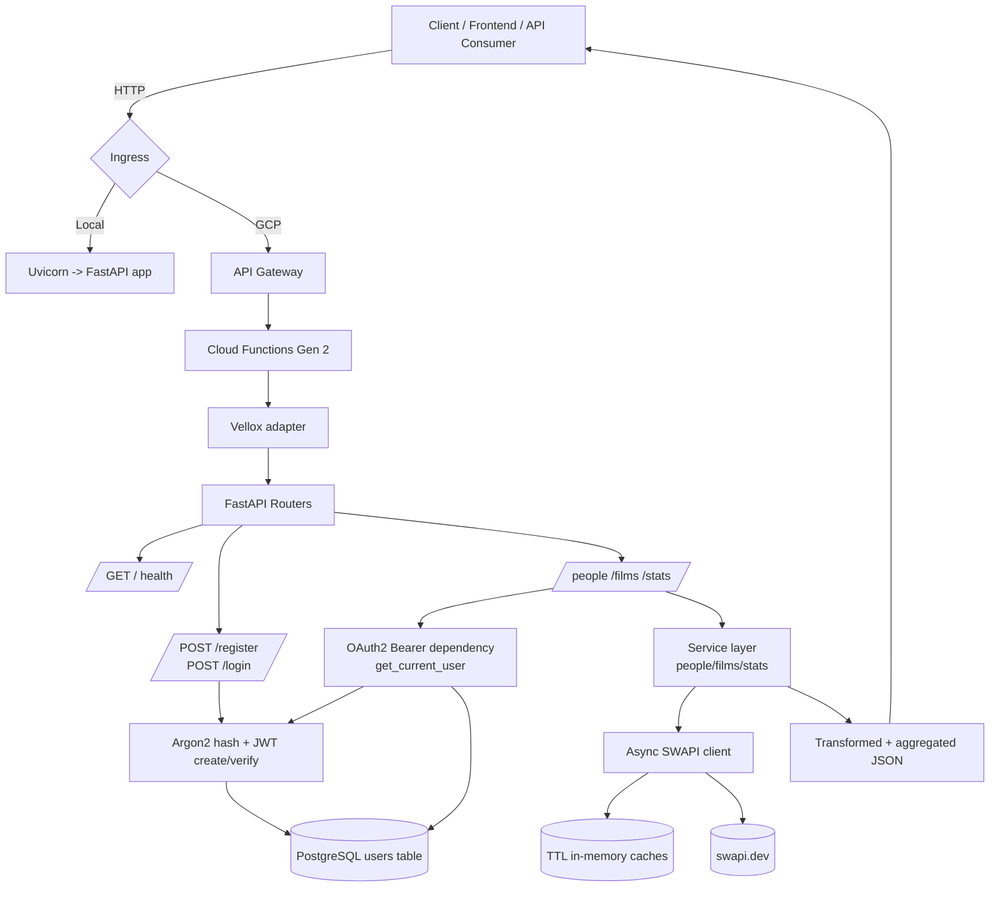

---

# Star Wars API – Case Técnico

Este projeto é uma API desenvolvida com **FastAPI** que atua como um **gateway inteligente** para a
[SWAPI (Star Wars API)](https://swapi.dev/).

O objetivo do projeto é demonstrar:

* Arquitetura backend escalável
* Boas práticas de organização de código
* Integração com APIs externas
* Segurança, cache e performance
* Deploy cloud-ready utilizando **Google Cloud Platform**
* Uso de **Cloud Functions Gen 2** com adaptação ASGI via **Vellox**

---

## Propósito do Projeto

A SWAPI fornece dados ricos do universo Star Wars, porém:

* Não possui autenticação
* Não oferece agregações ou estatísticas
* Não é otimizada para múltiplas requisições repetidas
* Não foi pensada para consumo direto em cenários produtivos

Esta API resolve esses pontos ao:

* Centralizar o acesso à SWAPI
* Proteger endpoints com **JWT**
* Criar **agregações e estatísticas**
* Aplicar **cache em memória**
* Persistir apenas dados sensíveis (usuários)
* Preparar a aplicação para execução em nuvem

---

## Estrutura do Projeto

A aplicação segue uma arquitetura em camadas, visando baixo acoplamento e alta manutenibilidade:

* **Routers (API Layer)**
  Recebem requisições HTTP, validam entradas e orquestram chamadas.

* **Services (Business Layer)**
  Concentram regras de negócio, agregações, filtros e transformações.

* **Clients**
  Comunicação assíncrona com a SWAPI usando `httpx`.

* **Security & Core**
  Autenticação JWT, hash de senhas com **Argon2** e configurações globais.

* **Cache em Memória (TTLCache)**
  Reduz chamadas repetidas à SWAPI, melhorando latência e protegendo a API externa.

* **Persistência (PostgreSQL)**
  Armazena exclusivamente dados de autenticação e usuários, utilizando **SQLAlchemy**.

---

## Arquitetura em Nuvem (GCP – Cloud Functions Gen 2)

O projeto foi desenhado para rodar em **Google Cloud Platform**, utilizando **Cloud Functions Gen 2** com container Docker.

O fluxo principal é:

```
Cliente → API Gateway → Cloud Functions Gen 2 → Vellox → FastAPI
```

O **API Gateway** expõe as rotas públicas e direciona as requisições para a Cloud Function.
A Cloud Function executa o container da aplicação FastAPI, adaptado ao runtime HTTP do GCP via **Vellox**.

---

## Integração com Vellox

O projeto utiliza **Vellox** como camada de adaptação entre o runtime do **Google Cloud Functions Gen 2** e a aplicação **FastAPI (ASGI)**.

O Vellox é responsável por:

* Atuar como handler HTTP da Cloud Function
* Converter a requisição do GCP para o formato ASGI
* Encaminhar a requisição para o FastAPI
* Permitir execução sem acoplamento direto ao runtime do GCP

Isso garante que a mesma aplicação:

* Rode localmente com `uvicorn`
* Rode em container Docker
* Rode em Cloud Functions Gen 2 sem refatoração

---

## Diagrama de Arquitetura



---

## Banco de Dados (PostgreSQL / Cloud SQL)

O banco de dados utilizado é **PostgreSQL**, executando:

* Localmente via `docker-compose`
* Em produção via **Cloud SQL**

O banco é utilizado exclusivamente para:

* Persistência de usuários
* Dados de autenticação
* Segurança e controle de acesso

Dados provenientes da SWAPI **não são persistidos**, apenas cacheados temporariamente, evitando duplicação e acoplamento desnecessário.

---

## Rotas da API e Responsabilidades

### Autenticação

Simula um cenário real de produção com controle de acesso.

* `POST /register`
  Criação de usuários com senha criptografada (Argon2).

* `POST /login`
  Autenticação e geração de token JWT.

---

### Filmes

Rotas focadas em **agregação e enriquecimento de dados**.

* `GET /films`
  Lista filmes com dados processados internamente.

* `GET /films/eras`
  Agrupa filmes por eras (trilogias).

---

### Personagens

Demonstra filtros, expansão e composição de respostas.

* `GET /people`
  Listagem com filtros opcionais.

* `GET /people/{id}`
  Detalhes completos de um personagem.

* `?expand=films`
  Inclui filmes relacionados.

---

### Estatísticas

Demonstra agregações e análise de dados.

* `GET /stats`
  Estatísticas gerais da saga.

---

## Variáveis de Ambiente

| Variável                      | Descrição          |
| ----------------------------- | ------------------ |
| `SWAPI_BASE_URL`              | URL base da SWAPI  |
| `DATABASE_URL`                | Conexão PostgreSQL |
| `SECRET_KEY`                  | Assinatura JWT     |
| `ACCESS_TOKEN_EXPIRE_MINUTES` | Expiração do token |

### `.env` / `.env.docker`

```env
# Alternativa de direcionamento no GCP. Use o espelho:
# https://swapi.py4e.com/api

SWAPI_BASE_URL=https://swapi.py4e.com/api
DATABASE_URL=postgresql://user:password@db:5432/starwars_db
SECRET_KEY=change_me
ACCESS_TOKEN_EXPIRE_MINUTES=30
```

---

## API Gateway (`starwars-gateway.yaml`)

Responsável por:

* Expor a API publicamente
* Mapear rotas HTTP
* Encaminhar requisições para a Cloud Function Gen 2

Fluxo:

```
/* → API Gateway → Cloud Function → Vellox → FastAPI
```

---

## Script `deploy.sh`

Centraliza variáveis e padroniza o deploy da aplicação e infraestrutura.

```bash
#!/bin/bash

# Projeto / Infra
export PROJECT_ID="project-example"
export REGION="us-central1"
export FUNCTION_NAME="starwars-api"

# Cloud SQL
export CONNECTION_NAME="$PROJECT_ID:$REGION:starwars-postgres"

# App
export DATABASE_URL="postgresql://user:password@/starwars_api?host=/cloudsql/$CONNECTION_NAME"
export SECRET_KEY="change_me"
export SWAPI_BASE_URL="https://swapi.dev/api"
export ACCESS_TOKEN_EXPIRE_MINUTES="30"
```

---

## Stack Técnica (requirements)

Principais dependências utilizadas:

* **FastAPI**
* **Vellox** (ASGI adapter para Cloud Functions)
* **SQLAlchemy**
* **PostgreSQL (psycopg2)**
* **JWT (python-jose)**
* **Argon2**
* **TTLCache (cachetools)**
* **Httpx**
* **Functions Framework (GCP)**

---

## Conclusão

Este projeto demonstra:

* Arquitetura backend limpa e modular
* Integração segura com API externa
* Cache e performance
* Persistência consciente de dados
* Deploy real em nuvem com GCP Gen 2
* Uso de adaptação ASGI com Vellox

---

